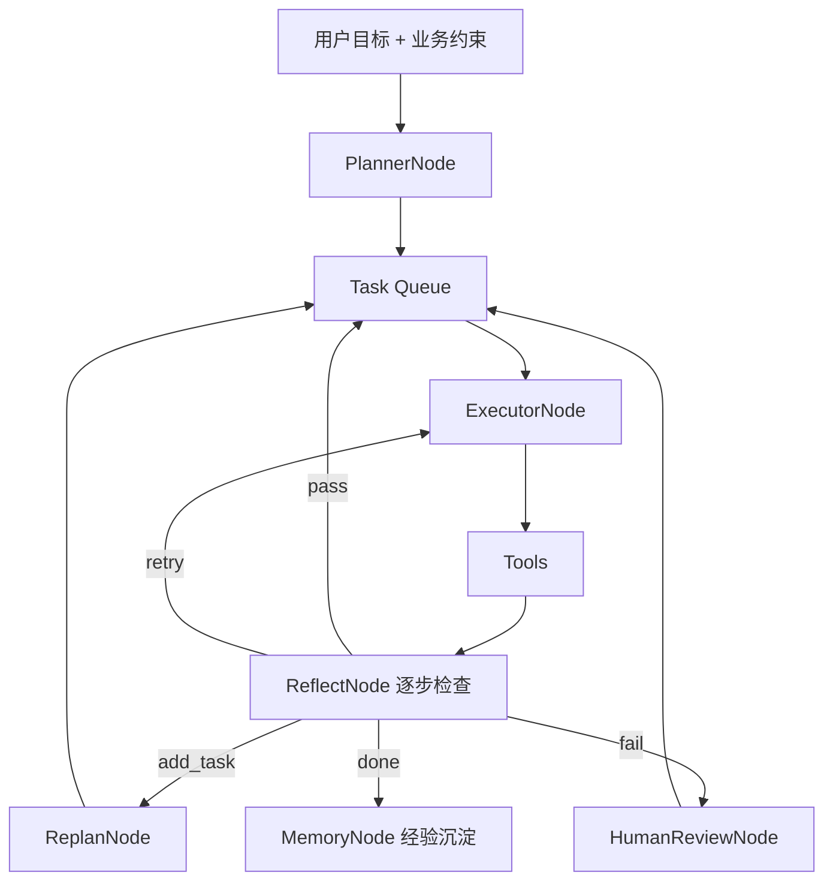

# 企业目标驱动型 Agent 执行系统 — 设计文档

> 日期：2026-06-09  
> 状态：已确认（v2）  
> 定位：HiveMindOS 核心 — 用户业务目标 → 自主规划 → 自主执行 → 反思修正 → 经验沉淀；知识库为沉淀手段

**一句话：** 不是问一句答一句，而是会拆解、会执行、会反思、会沉淀的智能任务系统。

---

## 一、产品定位

```
企业知识 + 企业标准 + 企业流程 + AI 执行
```

| 对比 | Chatbot | HiveMindOS 任务引擎 |
|------|---------|---------------------|
| 触发 | 用户问一句 | 用户提出业务目标 |
| 行为 | 一次性回答 | 拆解 → 执行 → 检查 → 修正 |
| 标准 | 无 | Rubric（人定目标 + 公司定模板 + Agent 检查） |
| 产出 | 文本 | 可审计执行过程 + 可追溯结果 + 可复用经验 |
| 知识库 | 检索来源 | 执行副产物（Wiki / memories / experience） |

**与现有模块关系：**

| 模块 | 角色 |
|------|------|
| Chat | 对话问答；复杂目标可「升级为任务」 |
| L1/L2 进化 | 被动沉淀；任务引擎是**主动、有目标**的沉淀 |
| 自动化 4 job | 未来降级为预置 Plan 模板 |
| Agent 任务页 | 任务中心：Plan、逐步进度、Reflect 评分、经验召回 |
| 人工审核页 | HumanReviewNode：冲突 / 低分 / 高风险写操作 |

---

## 二、核心编排（六节点）



> MemoryNode 将高分成功路径写入 `agent_experience` 表，供 Planner 下次召回复用。

| 节点 | 职责 | 输入 | 输出 |
|------|------|------|------|
| **PlannerNode** | 拆初始任务队列；召回相似成功经验 | 目标 + Rubric 类型 + 经验 Top-K | `tasks[]` |
| **PlanningCommittee** | 角色见 `settings/planning_committee.yaml` | 目标 + constraints | `tasks[]` + `planning_minutes[]` |
| **ExecutorNode** | 调 Tool 执行单步 | task + context | `result` |
| **ReflectNode** | 按 Rubric 打分；决定下一步 | result + goal + rubric | pass / retry / add_task / fail |
| **ReplanNode** | 追加或调整任务 | `reflect.new_tasks` | 更新队列 |
| **MemoryNode** | 沉淀成功路径（非全文） | 高分 workflow + 评分 | `agent_experience` |
| **HumanReviewNode** | 低分 / 高风险 / 冲突 | reflect / gate | 人批后继续 |

**核心原则：**

- **Executor 做事，Reflect 判断能不能往下走**
- **标准不是模型定的，是企业业务知识定的**
- **经验存路径，不存过时结果**

---

## 三、执行闭环

### 3.1 主流程

```
用户目标
   ↓
Planner（初始 tasks + task_type + rubric_id）
   ↓
Task Queue（pending → running → done / failed）
   ↓
for each task:
    Executor → Tool
       ↓
    StepReflect（Rubric 评分 + next_action）
       ↓
    pass     → 下一任务
    retry    → 重试本任务（上限 2 次）
    add_task → Replan 追加任务（单 goal 上限 +3）
    fail     → HumanReview 或标记 failed
   ↓
FinalReflect（总报告 + 是否满足目标）
   ↓
MemoryNode（score ≥ 80 沉淀 workflow）
```

### 3.2 Reflect 两级

| 级别 | 时机 | 职责 |
|------|------|------|
| **StepReflect** | 每个子任务完成后 | Rubric 打分、`pass/retry/add_task/fail` |
| **FinalReflect** | 全部任务结束 | 总报告 Markdown、success_criteria 验收、待人工清单 |

**StepReflect 输出示例：**

```json
{
  "score": 82,
  "passed": true,
  "status": "pass",
  "reason": "已检索到 12 条决策记忆，信息足够进入提炼",
  "problems": [],
  "dimensions": {
    "completeness": 85,
    "accuracy": 80,
    "relevance": 90,
    "actionability": 75
  },
  "next_action": "continue",
  "new_tasks": []
}
```

**评分档位：**

| 分数 | 含义 | 动作 |
|------|------|------|
| 90–100 | 优秀 | pass，进入下一步 |
| 70–89 | 可用 | pass，FinalReflect 标注小修项 |
| 50–69 | 信息不足 | add_task 或 retry |
| 0–49 | 失败 | retry（换参数）或 fail |

**防死循环：**

- 单任务 `retry` ≤ 2
- 单 goal `add_task` 追加 ≤ 3
- 总步数上限 20（可配置）

---

## 四、Rubric 体系（好坏标准谁定）

**三方共同制定：**

| 来源 | 内容 | 存储 |
|------|------|------|
| **业务负责人** | 目标约束（预算、周期、KPI、客群） | 用户 input + `goal.constraints` |
| **公司模板** | 交付物结构（必须包含哪些章节） | `settings/rubrics/*.yaml` |
| **Agent** | 按 Rubric 逐项检查打分 | StepReflect prompt |

**Rubric 文件示例** — `settings/rubrics/wiki_organize_decisions.yaml`：

```yaml
task_type: wiki_organize_decisions
label: 整理决策进 Wiki
pass_score: 75
criteria:
  - name: 检索完整性
    weight: 25
    check: 是否覆盖指定时间范围内 decision 类记忆与会话
  - name: 事实准确性
    weight: 25
    check: 提炼事实是否有明确来源，无臆造
  - name: 晋升合规
    weight: 25
    check: 候选分类、置信度、冲突处理是否符合 resolver 规则
  - name: 可交付性
    weight: 25
    check: 用户能否从报告直接看到 Wiki 变更与待人工项
```

**Phase 1.5 预埋** — `settings/rubrics/sales_proposal.yaml`（客户分析 + 销售方案，需 `web_search`）。

Planner 根据目标语义匹配 `task_type`；匹配不到则用 `generic_goal`。

---

## 五、数据模型

### 5.1 Goal（用户总目标，扩展现有 `tasks` 表）

| 字段 | 类型 | 说明 |
|------|------|------|
| `id` | str | UUID |
| `org_id` | str | 组织 |
| `input` | str | 用户原始目标 |
| `task_type` | str | Rubric 类型，如 `wiki_organize_decisions` |
| `rubric_id` | str | 对应 rubrics yaml |
| `constraints` | dict | 用户补充约束（预算、周期等，可选） |
| `phase` | str | 见 §5.4 |
| `plan` | dict | Planner 初始输出 |
| `queue` | list[dict] | 当前任务队列（含追加任务） |
| `steps` | list[dict] | 已执行步骤记录 |
| `checkpoints` | dict | 步骤 id → 结果摘要 |
| `reflections` | list[dict] | 每步 StepReflect 记录 |
| `score` | int \| null | FinalReflect 总分 |
| `result` | str \| null | FinalReflect Markdown 报告 |
| `experience_id` | str \| null | 沉淀的经验 id |
| `pending_step_id` | str \| null | 人工门暂停点 |
| `error` | str \| null | |
| `created_at` / `completed_at` | str | |

**Phase 1：** 单表 `tasks` 用 JSON 字段承载 `queue` / `reflections`（避免过早拆表）。  
**Phase 2：** 拆 `goals` + `goal_tasks` + `goal_task_runs`，支持 React Flow DAG。

### 5.2 Queue Task（子任务）

```json
{
  "id": "t1",
  "name": "检索本周决策记忆",
  "action": "search_memories",
  "params": { "category": "decision", "since_days": 7 },
  "tool": "search_memories",
  "status": "pending",
  "gate": "auto",
  "when": null,
  "reason": "收集原料",
  "retry_count": 0,
  "parent_reflect_id": null
}
```

> `action` / `tool` 同义，Planner 输出用 `action`；与讨论稿 `tool` 字段兼容。

### 5.3 Step 执行记录

```json
{
  "task_id": "t1",
  "action": "search_memories",
  "status": "done",
  "result_summary": { "count": 12 },
  "reflection": { "score": 85, "status": "pass" },
  "started_at": "...",
  "completed_at": "..."
}
```

### 5.4 Goal 生命周期

```
pending → planning → planned → executing ⇄ replanning → reflecting → done
                              ↘ awaiting_approval ↗
                              ↘ error / failed
```

### 5.5 Gate 策略

| gate | 行为 |
|------|------|
| `auto` | 直接执行 |
| `auto_if_low_risk` | decision/rule/entity 或 conflict → `awaiting_approval` |
| `human` | Plan 后整单待批 |
| `step_human` | 执行到该步前暂停 |

与 `6-自动与人工审核分界线.md` 档 1 对齐。

---

## 六、经验沉淀（MemoryNode）

### 6.1 理念

沉淀 4 类，**不存所有对话**：

| 类型 | 存什么 | 落点 |
|------|--------|------|
| 成功流程 | steps 顺序 + tools + task_type + score | `agent_experience.workflow` |
| 失败原因 | reflection.problems | `success=false` |
| 高质量结果 | 抽样进组织 Wiki | candidates → Wiki |
| 用户偏好 | 风格、格式 | memories（轨 A） |

**存路径，不存过时结果。**

### 6.2 `agent_experience` 表

```sql
CREATE TABLE agent_experience (
    id              TEXT PRIMARY KEY,
    org_id          TEXT NOT NULL,
    task_type       TEXT NOT NULL,
    goal            TEXT NOT NULL,
    success         BOOLEAN NOT NULL,
    score           INTEGER,
    workflow        TEXT NOT NULL,   -- JSON: steps/actions 顺序
    reflection      TEXT,            -- JSON: 末次或 FinalReflect
    final_output    TEXT,            -- 摘要，非全文
    tags            TEXT,            -- JSON array
    embedding_id    TEXT,            -- Qdrant point id（Phase 2）
    created_at      TEXT NOT NULL
);
```

**沉淀条件：** `success=true` 且 `score ≥ 80`（可配置）。

### 6.3 经验召回（Planner 输入）

新任务开始时：

1. `goal` 文本 embedding
2. Qdrant 检索同 org `task_type` 相似经验 Top-3
3. Planner prompt 注入「过去高分工作流参考」

Phase 1：仅 PostgreSQL/SQLite 按 `task_type` 取最近高分记录；Phase 2 接 Qdrant 语义召回。

---

## 七、组件架构

```
knowledge_base/
├── models/
│   ├── plan.py                 # Plan, QueueTask
│   ├── reflection.py           # StepReflectResult
│   └── task.py                 # Goal（扩展 Task）
├── core/
│   ├── agents/
│   │   ├── planner_agent.py
│   │   ├── step_reflect_agent.py
│   │   ├── final_reflect_agent.py
│   │   └── replan_agent.py
│   ├── execution/
│   │   ├── executor_engine.py
│   │   ├── condition_eval.py
│   │   └── orchestrator.py     # 主循环：execute → reflect → replan
│   ├── tools/
│   │   ├── task_toolkit.py
│   │   └── kb_toolkit.py
│   ├── registry/
│   │   ├── task_registry.py
│   │   └── experience_registry.py
│   └── services/
│       └── task_service.py
├── settings/
│   ├── task_tools.yaml
│   ├── task_gates.yaml
│   └── rubrics/
│       ├── wiki_organize_decisions.yaml
│       └── sales_proposal.yaml   # Phase 1.5 预埋
├── prompts/prompts.yaml          # planner, step_reflect, final_reflect, replan
└── app/routers/tasks.py
```

### 7.1 Task Tool Registry（Phase 1 · 知识域）

| action | 域 | 底层 |
|--------|-----|------|
| `get_org_stats` | meta | candidate_stats + memory count |
| `search_memories` | memory | MemoryRegistry |
| `list_sessions` / `read_session` | memory | ChatRegistry |
| `search_wiki` / `read_page` / `list_entities` | knowledge | WikiToolExecutor |
| `extract_facts` | extract | LLM 子调用 |
| `enqueue_candidates` | candidate | CandidateRegistry |
| `resolve_candidates` | candidate | candidate_service |
| `compile_candidates` | candidate | candidate_service |
| `llm_generate` | generate | 结构化生成（报告/方案草稿，Phase 1 用于 FinalReflect 前的中间产物） |

**Phase 1.5 新增：** `web_search`、`read_url`（销售方案场景）。

接口预留 `ToolRegistry.register()`，未来接 MCP。

---

## 八、API 设计

```
POST   /api/v1/orgs/{org_id}/tasks
       Body: { "input": "...", "constraints": {}, "auto_run": true }

GET    /api/v1/orgs/{org_id}/tasks/{id}
       → plan, queue, phase, steps, reflections, score, result, experience_id

POST   /api/v1/orgs/{org_id}/tasks/{id}/approve
       Body: { "from_task": "t6" }

POST   /api/v1/orgs/{org_id}/tasks/{id}/cancel

GET    /api/v1/orgs/{org_id}/experiences?task_type=...
       → 经验列表（治理 / 调试）
```

---

## 九、UI 设计（Agent 任务页）

1. **提交区**：「描述业务目标」；示例见 §十 MVP 场景
2. **Plan + Queue**：任务列表、状态、Rubric 类型
3. **执行过程**：每步 result + Reflect 分数 + problems
4. **`add_task` 追加**：高亮新增任务（Replan）
5. **`awaiting_approval`**：批准继续
6. **FinalReflect 报告**：总分、维度分、Wiki 链接、待人工项
7. **Phase 2**：React Flow DAG 可视化

---

## 十、MVP 场景策略（推荐 C）

| 阶段 | 场景 | 目的 |
|------|------|------|
| **Phase 1** | **A：整理本周项目决策进 Wiki** | 打穿六节点闭环；工具现成；可验证 Reflect + Rubric + 沉淀 |
| **Phase 1 同步预埋** | 销售方案 Rubric yaml + `task_type` 路由 | 不实现 web_search，但 Planner/Reflect 已认识该类型 |
| **Phase 1.5** | **B：客户分析 + 销售方案** | 加 `web_search`；用预埋 Rubric；产品演示叙事 |

**推荐 C 的理由：**

1. Phase 1 不被外域工具阻塞，2～3 周可验收端到端
2. 引擎能力（StepReflect、Replan、Rubric、experience）与场景无关，A 足以验证
3. 销售方案是企业叙事门面，Rubric 先写好，1.5 只加工具即可演示
4. A 与现有 memories/candidates/Wiki 管线直接咬合，沉淀闭环可实测

**Phase 1 验收输入：** 「帮我整理本周项目决策进 Wiki」

**期望：**

1. Planner 输出 6～7 步队列 + `task_type=wiki_organize_decisions`
2. 逐步执行，每步有 StepReflect 分数
3. 信息不足时 `add_task`（如「补充检索相关 project 会话」）
4. compile 遇 decision 高风险 → `awaiting_approval`
5. FinalReflect 报告 + `score ≥ 80` 写入 `agent_experience`
6. 第二次同类目标，Planner 参考历史 workflow

---

## 十一、技术栈（对齐现网）

| 能力 | Phase 1 | 后期 |
|------|---------|------|
| 后端 | FastAPI + BackgroundTasks | Celery（长任务） |
| 任务存储 | SQLite `tasks` + JSON queue | PostgreSQL 拆表 |
| 长期记忆 | SQLite `agent_experience` | + Qdrant embedding 召回 |
| 模型 | `model_layer.client` | Router 按节点选模型 |
| 工具协议 | yaml registry | MCP adapter |
| 前端 | Next.js 步骤列表 | React Flow DAG |
| 日志 | steps + reflections 表内 | LangSmith / audit 表 |

---

## 十二、后续扩展

- Chat「升级为任务」
- 预置 SOP 模板（新品营销、投标、AI 获客…）
- Shell / HTTP / email tools
- 多 Agent 并行
- Rust `planner.rs` 与 Plan JSON 格式对齐
- React Flow 执行图
- AI Workflow Governance 控制台（Rubric 在线编辑）

---

## 十三、修订记录

| 日期 | 说明 |
|------|------|
| 2026-06-09 | v1：Plan → Execute → Reflect 初稿 |
| 2026-06-09 | v2：并入六节点、StepReflect/Replan、Rubric、agent_experience；MVP 定为 C |
| 2026-06-09 | v2.1：统一核心编排 Mermaid 流程图；同步 `项目文档/7-自主任务引擎.md` |
