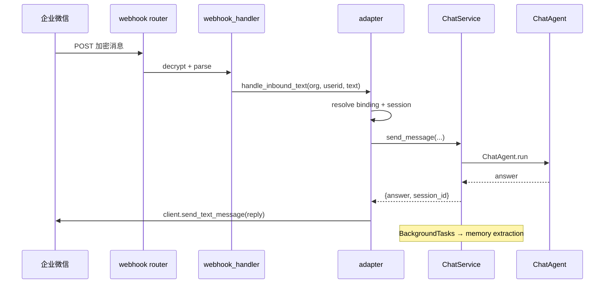

# 企业微信聊天打通 — 设计文档

> 日期：2026-06-11  
> 状态：已确认（会话策略 A）  
> 定位：HiveMindOS 第一个外部 IM 通道；复用 Chat 大脑，独立集成包

---

## 一、目标与边界

### 做什么

- 员工在企业微信里向 HiveMind 应用发消息，获得与 Web Chat 同等质量的回答
- 对话写入同一套 `chat_sessions` / `chat_messages`，触发同样的记忆提取（智慧进化）
- Agent 任务引擎可通过 Tool 主动向企微用户/群推送消息（Phase 4 已有规划，与本包共用 `client.py`）

### 不做什么（MVP）

- 不做 Web UI 里的企微聊天页（聊天发生在企微客户端）
- 不做群聊 @机器人 的复杂路由（先支持单聊 / 应用消息）
- 不做消息流式推送（企微 API 以完整文本回复；内部仍走 `send_message` 非流式路径）
- 不拆独立 Channel 微服务

---

## 二、目录结构

```
HiveMindOS/
├── integrations/
│   └── wechat_work/
│       ├── __init__.py
│       ├── config.py           # 企微配置模型 + 环境变量兜底
│       ├── client.py           # access_token、发消息、用户信息 API
│       ├── adapter.py          # 入站/出站消息 ↔ ChatService 桥接
│       ├── webhook_handler.py  # 验签、解密、事件分发（纯逻辑，无 FastAPI 依赖）
│       └── registry.py         # 企微绑定 + 组织配置持久化（PostgreSQL）
│
├── memory_layer/knowledge_base/
│   └── app/routers/
│       └── webhooks/
│           └── wechat_work.py  # HTTP 入口（GET 验证 + POST 回调）
│
├── agent_engine/tools/
│   └── wechat_work.py          # wechat_work_send Tool（复用 integrations client）
│
├── db/migrations/
│   └── 00N_wechat_work.sql     # 绑定表 + chat_sessions.channel 字段
│
└── webui/src/app/(platform)/
    └── integrations/
        └── wechat-work/
            └── page.tsx        # 仅配置页：CorpID、AgentId、Secret、测试连接
```

**原则：** `integrations/wechat_work/` 是自包含的企微领域包；FastAPI router 只做薄 HTTP 层；`ChatService` 保持通道无关。

---

## 三、数据模型

### 3.1 `chat_sessions` 扩展

```sql
ALTER TABLE chat_sessions
  ADD COLUMN channel TEXT NOT NULL DEFAULT 'web'
    CHECK (channel IN ('web', 'wechat_work')),
  ADD COLUMN external_session_id TEXT;  -- 企微侧会话标识（可选，单聊可为 userid）

CREATE INDEX idx_chat_sessions_channel
  ON chat_sessions (org_id, user_id, channel, updated_at DESC);
```

- Web 会话：`channel = 'web'`，`external_session_id = NULL`
- 企微会话：`channel = 'wechat_work'`，`external_session_id = '{wechat_userid}'`（单用户单活跃会话策略，MVP）

### 3.2 `wechat_work_org_config`（组织级应用配置）

```sql
CREATE TABLE wechat_work_org_config (
    org_id          TEXT PRIMARY KEY,
    corp_id         TEXT NOT NULL,
    agent_id        TEXT NOT NULL,
    secret          TEXT NOT NULL,          -- 加密存储（应用 Secret）
    token           TEXT NOT NULL,          -- 回调 Token
    encoding_aes_key TEXT NOT NULL,         -- 回调 EncodingAESKey
    enabled         BOOLEAN NOT NULL DEFAULT false,
    created_at      TIMESTAMPTZ NOT NULL DEFAULT NOW(),
    updated_at      TIMESTAMPTZ NOT NULL DEFAULT NOW()
);
```

### 3.3 `wechat_work_user_bindings`（身份映射）

```sql
CREATE TABLE wechat_work_user_bindings (
    id              BIGSERIAL PRIMARY KEY,
    org_id          TEXT NOT NULL,
    platform_user_id TEXT NOT NULL,   -- HiveMind user_id（来自 NextAuth / KB）
    wechat_userid   TEXT NOT NULL,    -- 企微成员 userid
    wechat_name     TEXT,
    bound_at        TIMESTAMPTZ NOT NULL DEFAULT NOW(),
    UNIQUE (org_id, platform_user_id),
    UNIQUE (org_id, wechat_userid)
);
```

**MVP 绑定策略：** 管理员在配置页手动绑定，或通过企微 OAuth 扫码绑定（Phase 2）。未绑定用户发消息时回复引导文案。

---

## 四、模块职责

### 4.1 `client.py`

| 方法 | 说明 |
|------|------|
| `get_access_token(corp_id, secret)` | 带内存缓存，过期前 5 分钟刷新 |
| `send_text_message(agent_id, to_user, content)` | 应用消息 · 文本 |
| `send_markdown_message(...)` | 应用消息 · markdown（Agent Tool 用） |
| `get_user_info(userid)` | 可选，用于绑定页展示 |

不依赖 FastAPI；可被 `adapter`、`agent_engine/tools/wechat_work.py` 共用。

### 4.2 `adapter.py`

核心桥接，唯一调用 `ChatService` 的集成层入口：

```python
def handle_inbound_text(
    org_id: str,
    wechat_userid: str,
    text: str,
) -> str:
    """
    1. resolve platform_user_id via user_bindings（未绑定 → 返回引导语）
    2. find_or_create_session(org_id, user_id, channel='wechat_work', external=wechat_userid)
    3. chat_service.send_message(org_id, text, session_id, user_id)
    4. return assistant reply text
    """
```

出站由 `adapter.reply(to_user, content)` 委托 `client.send_text_message`。

### 4.3 `webhook_handler.py`

纯函数，便于单测：

| 函数 | 说明 |
|------|------|
| `verify_url(query_params, token, aes_key)` | GET 回调 URL 验证 |
| `decrypt_message(body, signature, timestamp, nonce, token, aes_key)` | POST 消息解密 |
| `parse_event(xml_or_json)` | 解析为统一 `InboundEvent` dataclass |
| `dispatch(event, org_id)` | 按事件类型调 `adapter` |

支持事件（MVP）：

- `text` 用户文本消息 → `adapter.handle_inbound_text`
- 其他类型 → 回复「暂不支持该消息类型」

### 4.4 FastAPI Router

```
GET  /api/v1/webhooks/wechat-work/{org_id}     # URL 验证（企微后台配置）
POST /api/v1/webhooks/wechat-work/{org_id}     # 消息回调
```

- **不走** Next.js BFF（企微需要公网 HTTPS 直达 FastAPI 或反向代理）
- **不走** `user_id` 注入（webhook 用 `org_id` 路径 + 企微 userid 映射）
- 注册于 `app/main.py`：`app.include_router(webhooks_wechat_work.router, prefix="/api/v1")`

### 4.5 管理 API（组织内，需鉴权）

```
GET    /api/v1/orgs/{org_id}/integrations/wechat-work          # 读配置（secret 脱敏）
PUT    /api/v1/orgs/{org_id}/integrations/wechat-work          # 保存配置
POST   /api/v1/orgs/{org_id}/integrations/wechat-work/test     # 测试 token + 发测试消息
GET    /api/v1/orgs/{org_id}/integrations/wechat-work/bindings
POST   /api/v1/orgs/{org_id}/integrations/wechat-work/bindings
DELETE /api/v1/orgs/{org_id}/integrations/wechat-work/bindings/{id}
```

BFF 代理路径：`/api/kb/[orgId]/integrations/wechat-work/*`（与现有 chat BFF 模式一致）。

---

## 五、数据流

### 入站（用户 → HiveMind）



### 出站（Agent → 用户）

```
TaskToolExecutor → wechat_work_send action
  → agent_engine/tools/wechat_work.py
  → integrations.wechat_work.client.send_* 
  → (可选) human_review 审批门
```

与入站共用 `client.py`，不经过 `ChatService`。

---

## 六、与现有模块的衔接

| 模块 | 改动 |
|------|------|
| `chat_service.py` | **不改核心逻辑**；`ChatRegistry.create_session` 增加 `channel` / `external_session_id` 可选参数 |
| `chat_registry.py` | `find_active_session(org, user, channel, external)` 新方法 |
| `hivemind-chat` UI | MVP 无改动；可选后续加 channel 筛选 |
| `human-review` | `wechat_work_send` 审批已有权限名，接通 executor |
| `navigation.ts` | `工具箱` 下或新增 `集成` 入口 → `/integrations/wechat-work` |

---

## 七、配置与环境变量

组织级配置存 DB（`wechat_work_org_config`），环境变量仅作开发兜底：

```env
# 可选：单租户开发快捷配置
WECHAT_WORK_CORP_ID=
WECHAT_WORK_AGENT_ID=
WECHAT_WORK_SECRET=
WECHAT_WORK_TOKEN=
WECHAT_WORK_ENCODING_AES_KEY=
```

生产：每 org 在 Web UI 配置，Secret 加密后存 PostgreSQL。

---

## 八、错误处理

| 场景 | 行为 |
|------|------|
| 未绑定企微用户 | 回复固定引导：「请先在 HiveMind 平台完成账号绑定」 |
| org 未启用 / 无配置 | 返回 HTTP 404，企微侧重试 |
| access_token 失效 | client 自动刷新一次后重试 |
| ChatAgent 超时 / 失败 | 回复「处理失败，请稍后重试」+ 记 error log |
| 消息过长 | 企微单条上限 2048 字节，adapter 截断并提示 |

---

## 九、实施分期

### Phase 1 — 双向单聊（本设计范围）

- [ ] `integrations/wechat_work/` 三包（client / adapter / webhook_handler）
- [ ] DB migration + registry
- [ ] FastAPI webhook + 管理 API
- [ ] Web UI 配置页
- [ ] 手动用户绑定

### Phase 2 — 增强

- [ ] 企微 OAuth 扫码自动绑定
- [ ] `hivemind-chat` 会话列表显示 channel 标签
- [ ] 群聊 @机器人

### Phase 3 — Agent 出站

- [ ] `agent_engine/tools/wechat_work.py` + `task_tools.yaml`
- [ ] `human-review` 接通 `wechat_work_send`

---

## 十、测试策略

| 层级 | 内容 |
|------|------|
| 单元测试 | `webhook_handler` 验签/解密（企微官方 sample） |
| 单元测试 | `adapter` mock ChatService，验证 session 复用 |
| 集成测试 | `client` token 获取（需真实凭证，标记 skip） |
| 手工 | 企微后台配回调 URL → 发消息 → 检查 DB 会话 + 记忆提取 |

---

## 十一、已确认决策

| 项 | 决策 |
|----|------|
| 会话策略 | **A — 单用户单活跃企微会话**（`channel='wechat_work'` + `external_session_id=wechat_userid`，复用已有 active 会话） |
| 绑定方式 MVP | 管理员手动绑定（OAuth 放 Phase 2） |
| Webhook 联调 | 开发用 ngrok；生产反向代理到 FastAPI :8006 |

**实施计划：** `docs/plans/2026-06-11-wechat-work-integration.md`
