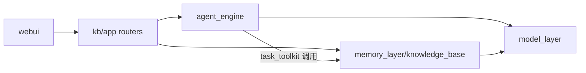

# 程序目录结构

> **定位：** HiveMindOS 仓库的**唯一目录地图**。新增/移动/删除模块或配置时，**必须同步更新本文档**（含修订记录）。  
> **产品原则：** 核心是「用户说目标 → 系统规划执行」；知识库是**沉淀层**，不是指挥中心。  
> **架构对照：** [1-程序架构.md](./1-程序架构.md) · 自主任务详见 [7-自主任务引擎.md](./7-自主任务引擎.md)

---

## 一、模块总览

| 模块 | 路径 | 职责 | 状态 |
|------|------|------|------|
| **自主任务引擎** | `agent_engine/` | Plan → Execute → Reflect；规划委员会、任务队列、复盘与交付物 | ✅ 在用 |
| **知识沉淀层** | `memory_layer/knowledge_base/` | Wiki / 智慧 / 候选池 / Chat / 定时运维 API | ✅ 在用 |
| **模型层** | `model_layer/` | OpenAI 兼容 LLM / Embedding 客户端 | ✅ 在用 |
| **Web UI** | `webui/` | Next.js 平台界面（任务中心、知识库、Chat） | ✅ 在用 |
| **工具脚本** | `scripts/` | 配置列举、向量同步、DB 迁移等运维脚本 | ✅ 在用 |
| **预留层** | `agent_layer/` `execution_layer/` `human_layer/` `tool_layer/` `workflow_layer/` `audit_layer/` | 早期分层占位，**未被主流程 import** | ⏸ 预留 |
| **遗留 demo** | `Memory/` `memory_demo/` | 独立演示，非主链路 | ⚠️ 遗留 |

**依赖关系（简图）：**



---

## 二、目录树

```
666-HiveMindOS/
│
├── agent_engine/                         # 自主任务引擎（与知识沉淀解耦）
│   ├── README.md
│   ├── settings/                         # 任务引擎专用配置（勿放入 memory_layer）
│   │   ├── loader.py
│   │   ├── planning_committee.yaml       # 规划委员会角色与触发
│   │   ├── task_tools.yaml               # Planner 可见 action 白名单
│   │   ├── task_gates.yaml               # 重试上限、人工门、经验沉淀阈值
│   │   └── rubrics/                      # 任务评分标准
│   │       ├── generic_goal.yaml
│   │       ├── wiki_organize_decisions.yaml
│   │       └── sales_proposal.yaml
│   ├── agents/
│   │   ├── planner_agent.py              # 单 Planner（非委员会路径）
│   │   ├── planning_committee.py         # 领域 → 风险 → 主持人
│   │   ├── step_reflect_agent.py         # 逐步 Reflect
│   │   ├── final_reflect_agent.py        # 收尾复盘报告
│   │   └── replan_agent.py               # 追加任务
│   ├── execution/
│   │   ├── orchestrator.py               # Plan 队列主循环
│   │   ├── executor_engine.py            # 单步执行 + gate
│   │   ├── condition_eval.py             # when 条件求值
│   │   └── exceptions.py                 # ApprovalRequired 等
│   ├── services/
│   │   ├── task_service.py               # 任务生命周期入口 run_goal()
│   │   └── experience_service.py         # 经验召回 / 向量沉淀
│   ├── models/
│   │   ├── plan.py                       # Plan、QueueTask
│   │   ├── task.py                       # Task 实体
│   │   └── reflection.py                 # StepReflect 结果
│   ├── registry/
│   │   ├── task_registry.py              # tasks.db
│   │   └── experience_registry.py
│   ├── tools/
│   │   ├── task_toolkit.py               # 封装 KB 能力 + llm_generate / web
│   │   └── web_tools.py                  # web_search、read_url
│   ├── domain/
│   │   ├── committee_config.py           # 读 planning_committee.yaml
│   │   ├── rubric.py                     # 读 rubrics/*.yaml
│   │   ├── deliverable.py                # 从步骤提取用户交付物
│   │   └── task_present.py               # API 展示层（交付物 vs 复盘）
│   └── tests/                            # 引擎单测（PYTHONPATH=. 运行）
│
├── memory_layer/knowledge_base/          # 知识沉淀 + 统一 HTTP 服务
│   ├── README.md
│   ├── config.py                         # 路径、DB、Qdrant、模型 env
│   ├── app/                              # FastAPI（默认 :8006）
│   │   ├── main.py
│   │   └── routers/
│   │       ├── tasks.py                  # → agent_engine.services.task_service
│   │       ├── chat.py                   # HiveMind Chat
│   │       ├── query.py                  # 知识问答
│   │       ├── ingest.py                 # 资料编译入库
│   │       ├── wiki.py
│   │       ├── memories.py
│   │       ├── candidates.py             # 候选池
│   │       ├── automations.py            # 定时运维
│   │       └── overview.py
│   ├── settings/                         # 知识沉淀专用配置（勿放任务引擎配置）
│   │   ├── loader.py
│   │   ├── taxonomy.yaml                 # 记忆 / Wiki 分类
│   │   ├── wiki.yaml
│   │   ├── pipeline.yaml                 # 智慧进化流水线
│   │   ├── resolver.yaml                 # 候选晋升
│   │   ├── recall.yaml                   # Context Builder 召回
│   │   ├── automations.yaml
│   │   └── tools.yaml                    # Chat/Query 函数 schema
│   ├── prompts/
│   │   ├── prompts.yaml                  # 全站 LLM 模板（含 agents.planning_*）
│   │   └── loader.py
│   ├── core/
│   │   ├── agents/                       # KB / Chat 专用 Agent（非任务引擎）
│   │   │   ├── ingest_agent.py
│   │   │   ├── query_agent.py
│   │   │   ├── chat_agent.py
│   │   │   ├── memory_extractor.py
│   │   │   ├── session_recap_agent.py
│   │   │   └── lint_agent.py
│   │   ├── compiler/                     # 实体 / 流程提取 → Wiki
│   │   ├── wiki/                         # Wiki 读写、分类、迁移
│   │   ├── graph/                        # 实体图谱 SQLite
│   │   ├── vector/                       # Qdrant 智慧 + 经验向量
│   │   ├── registry/                     # memory / chat / candidate / automation
│   │   ├── services/                       # memory、chat、pipeline、candidate…
│   │   ├── tools/
│   │   │   └── kb_toolkit.py             # Wiki 工具（被 task_toolkit 复用）
│   │   ├── domain/                       # taxonomy、wiki_meta、pipeline_meta…
│   │   ├── parsers/
│   │   └── db/                           # PostgreSQL 原始会话等
│   ├── models/                           # memory、chat、candidate、entity…
│   ├── sdk/
│   │   └── knowledge_base.py             # 外部模块调用 KB 的统一门面
│   ├── storage/                          # 默认运行时数据（可用 STORAGE_ROOT 覆盖）
│   │   ├── raw/  wiki/  graph/
│   │   ├── registry.db  tasks.db  automation_runs.db
│   └── tests/                            # KB 相关单测
│
├── model_layer/
│   ├── client.py                         # llm.complete / embed
│   └── __init__.py
│
├── webui/                                # Next.js 前端
│   └── src/
│       ├── app/(platform)/               # 任务中心、知识库、Chat、审核…
│       │   ├── tasks/agent/              # 自主任务页
│       │   ├── tasks/ops/                # 定时运维
│       │   ├── hivemind-chat/
│       │   └── knowledge-base/           # Wiki / 图谱 / 入库 / 问答
│       ├── app/api/kb/[orgId]/           # BFF 代理 → FastAPI :8006
│       ├── components/knowledge-base/      # agent-tasks-view、agent-task-detail…
│       └── lib/                          # kb-api、kb-types、task-display
│
├── scripts/                              # 运维与开发辅助
│   ├── list_settings.py                  # 列举 KB + agent_engine 配置
│   ├── list_prompts.py
│   ├── sync_memory_vectors.py
│   └── migrate_db.py
│
├── docs/plans/                           # 设计与实现计划（英文/过程文档）
├── 项目文档/                             # 中文产品 & 工程文档（本文件所在目录）
├── storage/                              # 可选的根级存储镜像（优先用 kb/storage）
└── db/migrations/                        # SQL 迁移
```

---

## 三、配置归属（防放错目录）

| 配置 | 正确路径 | 错误示例 |
|------|----------|----------|
| 规划委员会角色 | `agent_engine/settings/planning_committee.yaml` | ~~memory_layer/.../settings/~~ |
| 任务工具白名单 | `agent_engine/settings/task_tools.yaml` | — |
| 任务 gate / 重试 | `agent_engine/settings/task_gates.yaml` | — |
| 任务 Rubric | `agent_engine/settings/rubrics/*.yaml` | — |
| Wiki / 记忆分类 | `memory_layer/.../settings/taxonomy.yaml` | — |
| Chat 工具 schema | `memory_layer/.../settings/tools.yaml` | — |
| LLM Prompt 模板 | `memory_layer/.../prompts/prompts.yaml` | 任务与 KB 共用，按 `agents.*` 分组 |

列举全部配置：`python scripts/list_settings.py`

---

## 四、关键入口速查

| 能力 | 后端入口 | 前端路由 |
|------|----------|----------|
| 创建自主任务 | `POST .../tasks` → `task_service.run_goal` | `/tasks/agent` |
| 规划委员会 | `PlanningCommittee` + `planning_committee.yaml` | 任务详情「规划委员会」面板 |
| Chat 升级任务 | `constraints.source = chat_upgrade` | `/hivemind-chat` |
| 知识问答 | `routers/query.py` | `/knowledge-base/query` |
| 候选池 / Wiki 编译 | `routers/candidates.py` | 知识库相关页 |
| 定时运维 | `routers/automations.py` | `/tasks/ops` |

---

## 五、维护约定

1. **移动或新增顶层包**（如再拆 `router/`、`flow/`）→ 更新「第二节目录树」+「第一节模块总览」。
2. **新增 yaml 配置** → 更新第三节配置表 + 运行 `list_settings.py` 自证。
3. **Agent 归属变更** → 任务相关放 `agent_engine/agents/`；KB/Chat 相关放 `memory_layer/.../core/agents/`。
4. **删除代码** → 从目录树移除，并在修订记录注明。
5. **AI / 自动化改目录时** → 将「已更新 0-程序目录结构.md」写入 PR / 提交说明。

---

## 六、修订记录

| 日期 | 说明 |
|------|------|
| 2026-06-09 | 初版：从对话摘要整理 agent_engine 与 memory_layer 分界 |
| 2026-06-09 | 扩写：模块总览、完整目录树、配置归属、入口速查、维护约定 |
