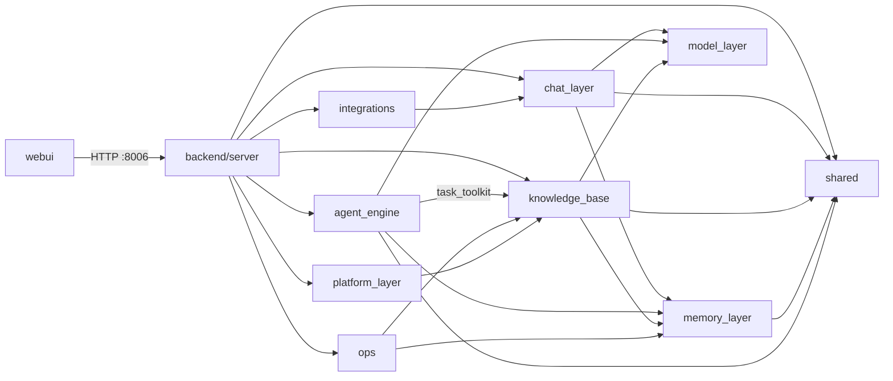

# 程序目录结构

> **定位：** HiveMindOS 仓库的**唯一目录地图**。新增/移动/删除模块或配置时，**必须同步更新本文档**（含修订记录）。  
> **产品原则：** 核心是「用户说目标 → 系统规划执行」；知识库是**沉淀层**，不是指挥中心。  
> **架构对照：** [1-程序架构.md](./1-程序架构.md) · 自主任务详见 [7-自主任务引擎.md](./7-自主任务引擎.md)

---

## 一、模块总览

**顶层原则：** 仓库按 **backend + frontend 物理分仓**——后端所有 Python 在 `backend/`，前端在 `webui/`。`backend/` 内各子系统**平行**放置，互不嵌套；`memory_layer/` 只放**记忆子系统**。

| 模块 | 路径 | 职责 | 状态 |
|------|------|------|------|
| **后端总目录** | `backend/` | 所有后端 Python（包、脚本、迁移、测试） | ✅ 在用 |
| **HTTP 服务** | `backend/server/` | FastAPI 路由层（默认 :8006） | ✅ 在用 |
| **自主任务引擎** | `backend/agent_engine/` | Plan → Execute → Reflect；规划委员会、任务队列、复盘与交付物 | ✅ 在用 |
| **知识沉淀层** | `backend/knowledge_base/` | Wiki / 候选池 / 入库编译 等业务逻辑 | ✅ 在用 |
| **共享基础设施** | `backend/shared/` | 全局 config、PostgreSQL、taxonomy、Wiki 工具 | ✅ 在用 |
| **HiveMind Chat** | `backend/chat_layer/` | 对话、上下文组装、快捷问题、会话管线、Chat→Wiki 编译 | ✅ 在用 |
| **记忆子系统** | `backend/memory_layer/` | L1/L2 智慧、向量召回、会话复盘、文档智慧提炼 | ✅ 在用 |
| **运维编排** | `backend/ops/` | 定时运维任务、YAML 工作流与 cron 调度 | ✅ 在用 |
| **平台能力** | `backend/platform_layer/` | 跨模块审计日志等 | ✅ 在用 |
| **第三方集成** | `backend/integrations/` | 企微等通道：SDK、adapter、webhook 逻辑 | ✅ 在用 |
| **模型层** | `backend/model_layer/` | 多 Provider LLM / Embedding（profile 注册表） | ✅ 在用 |
| **工具脚本** | `backend/scripts/` | 配置列举、向量同步、DB 迁移等运维脚本 | ✅ 在用 |
| **SQL 迁移** | `backend/db/migrations/` | PostgreSQL 迁移 | ✅ 在用 |
| **Web UI** | `webui/` | Next.js 平台界面（任务中心、知识库、Chat） | ✅ 在用 |

**运行约定：** 后端命令统一在 `backend/` 下执行（`cd backend && uvicorn main:app …`，`main.py` 会先加载根 `.env`/`webui/.env` 再导入 `server.main:app`）；`.env` 仍放仓库**根目录**。

**依赖关系（简图）：**



---

## 二、目录树

```
666-HiveMindOS/
│
├── .env  .env.example                  # 后端配置源（根目录，后端向上读取）
├── README.md
│
├── backend/                            # ── 后端（所有 Python）──
│   ├── main.py                         # 入口（加载根 .env → server.main:app）
│   ├── requirements.txt
│   │
│   ├── server/                         # FastAPI HTTP 层（默认 :8006）
│   │   ├── main.py
│   │   ├── logging_config.py
│   │   └── routers/
│   │       ├── tasks.py                # → agent_engine.services.task_service
│   │       ├── chat.py                 # HiveMind Chat
│   │       ├── query.py / ingest.py / wiki.py / memories.py
│   │       ├── candidates.py           # 候选池
│   │       ├── automations.py          # 定时运维
│   │       ├── skills.py / playbook.py / settings.py / usage.py / audit.py
│   │       ├── workflows.py / overview.py
│   │       ├── integrations/           # 集成管理 API（企微绑定等）
│   │       └── webhooks/               # 公网回调（企微验签）
│   │
│   ├── shared/                         # 共享基础设施
│   │   ├── config.py                   # STORAGE_ROOT / DATABASE_URL / Qdrant
│   │   ├── db/                         # postgres 连接池、序列修复
│   │   ├── settings/                   # taxonomy.yaml, tools.yaml
│   │   ├── domain/                     # taxonomy 词汇表
│   │   └── tools/                      # kb_toolkit（Wiki 工具）
│   │
│   ├── prompts/                        # LLM Prompt 模板（全模块共用）
│   │
│   ├── agent_engine/                   # 自主任务引擎
│   │   ├── settings/ agents/ execution/ services/
│   │   ├── storage/skills/             # SKILL.md 产物
│   │   └── tests/
│   │
│   ├── knowledge_base/                 # 知识沉淀（Wiki / 候选池 / 编译）
│   │   ├── settings/                   # wiki / pipeline / resolver 等
│   │   ├── core/
│   │   │   ├── pipelines/              # ingest / query / lint
│   │   │   ├── compiler/ wiki/ graph/ registry/ services/
│   │   │   └── domain/ parsers/
│   │   ├── models/ sdk/ tests/
│   │
│   ├── chat_layer/                     # HiveMind Chat
│   │   ├── settings/                   # chat / recall / playbook.yaml
│   │   └── core/{services,pipelines,registry,compiler}/
│   │
│   ├── memory_layer/                   # 记忆子系统（智慧 / 向量 / 复盘）
│   │   ├── core/{services,pipelines,registry,parsers,vector}/
│   │   └── models/
│   │
│   ├── ops/                            # 运维编排（定时任务 + YAML 工作流）
│   │   ├── settings/                   # automations.yaml, workflow_templates.yaml
│   │   └── core/{services,registry,domain,parsers}/
│   │
│   ├── platform_layer/                 # 跨模块平台（审计日志等）
│   ├── integrations/                   # 第三方通道（gateway、wechat_work、tests）
│   ├── model_layer/                    # 多 Provider LLM + usage / 用户模型偏好
│   │   └── services/                   # usage_service, model_settings_service
│   ├── scripts/                        # 运维脚本（install.sh、start.sh、migrate_db…）
│   └── db/migrations/                  # PostgreSQL 迁移
│
├── webui/                              # ── 前端（Next.js）──
│   ├── prisma/schema.prisma
│   └── src/
│       ├── app/(platform)/             # 任务、知识库、Chat、集成…
│       ├── app/auth/ app/api/          # api/kb/[orgId] BFF → 后端 :8006
│       ├── components/ lib/
│       └── server/                     # Next.js 服务端工具（fleet 等，非 Python）
│
├── docs/plans/                         # 英文设计与实现计划
├── 项目文档/                           # 中文产品 & 工程文档
└── storage/                            # 运行时数据（gitignored，由 STORAGE_ROOT 控制）
```

---

## 三、配置归属（防放错目录）

> 路径均相对 `backend/`。

| 配置 | 正确路径 | 错误示例 |
|------|----------|----------|
| 规划委员会角色 | `backend/agent_engine/settings/planning_committee.yaml` | ~~knowledge_base/settings/~~ |
| 任务工具白名单 | `backend/agent_engine/settings/task_tools.yaml` | — |
| 任务 gate / 重试 | `backend/agent_engine/settings/task_gates.yaml` | — |
| 任务 Rubric | `backend/agent_engine/settings/rubrics/*.yaml` | — |
| Wiki / 记忆分类 | `backend/shared/settings/taxonomy.yaml` | ~~knowledge_base/settings/~~ |
| Chat / 召回 / Playbook | `backend/chat_layer/settings/chat.yaml`、`recall.yaml`、`playbook.yaml` | ~~knowledge_base/settings/~~ |
| Wiki 工具 schema | `backend/shared/settings/tools.yaml` | ~~knowledge_base/settings/~~ |
| 定时运维 / 工作流模板 | `backend/ops/settings/automations.yaml`、`workflow_templates.yaml` | ~~knowledge_base/settings/~~ |
| LLM Prompt 模板 | `backend/prompts/prompts.yaml` | ~~knowledge_base/prompts/~~ |
| 全局路径 / 数据库 | `backend/shared/config.py` | ~~knowledge_base/config.py~~ |
| 模型 profile 注册表 | `backend/model_layer/settings/models.yaml` | — |
| 企微集成 | `backend/integrations/wechat_work/` + 根 `.env` | — |

**运行时数据：** 仓库根 `storage/`（`STORAGE_ROOT=storage`，相对路径相对 repo 根解析）；Skills 在 `backend/agent_engine/storage/skills/`（`SKILLS_ROOT`）。

列举全部配置：`cd backend && python scripts/list_settings.py`

---

## 四、关键入口速查

| 能力 | 后端入口 | 前端路由 |
|------|----------|----------|
| 创建自主任务 | `POST .../tasks` → `task_service.run_goal` | `/tasks/agent` |
| 规划委员会 | `PlanningCommittee` + `planning_committee.yaml` | 任务详情「规划委员会」面板 |
| Chat 升级任务 | `constraints.source = chat_upgrade` | `/hivemind-chat` |
| 知识问答 | `backend/server/routers/query.py` | `/knowledge-base/query` |
| 候选池 / Wiki 编译 | `backend/server/routers/candidates.py` | 知识库相关页 |
| 定时运维 | `backend/server/routers/automations.py` | `/tasks/ops` |
| 企微集成 | `backend/integrations/wechat_work/` + `backend/server/routers/webhooks/` | `/integrations/wechat-work` |

---

## 五、维护约定

1. **后端代码** 一律放 `backend/`；**前端代码** 放 `webui/`。新增顶层包 → 更新「第二节目录树」+「第一节模块总览」；**禁止**把 agent / KB / server 塞进 `memory_layer/`。
2. **新增 yaml 配置** → 更新第三节配置表 + 运行 `list_settings.py` 自证。
3. **处理单元归属** → 自主任务 agent（规划/反思）放 `backend/agent_engine/agents/`；KB 沉淀工序（入库/问答/Chat/提炼）放 `backend/knowledge_base/core/pipelines/`；纯记忆相关最终放 `backend/memory_layer/`。`agents/` 一词只留给真正会规划执行的自主 agent。
4. **删除代码** → 从目录树移除，并在修订记录注明。
5. **AI / 自动化改目录时** → 将「已更新 0-程序目录结构.md」写入 PR / 提交说明。

---

## 六、修订记录

| 日期 | 说明 |
|------|------|
| 2026-06-09 | 初版：从对话摘要整理 agent_engine 与 memory_layer 分界 |
| 2026-06-09 | 扩写：模块总览、完整目录树、配置归属、入口速查、维护约定 |
| 2026-06-09 | model_layer：多 Provider profile 注册表（models.yaml） |
| 2026-06-10 | webui：NextAuth 注册登录、users 表、org 隔离与路由守卫 |
| 2026-06-10 | webui：user_id 注入 KB BFF、账户页 /account、营销页登录引导 |
| 2026-06-13 | server/：FastAPI 从 kb/app/ 迁至顶层 server/ |
| 2026-06-13 | knowledge_base/：从 memory_layer/ 下迁至顶层；memory_layer 仅保留记忆子系统 |
| 2026-06-13 | knowledge_base/core/agents/ → pipelines/（与 agent_engine 自主 agent 区分；纯 LLM 沉淀工序） |
| 2026-06-13 | **backend + frontend 物理分仓**：所有后端 Python 迁入 backend/；.env 仍在仓库根；后端命令在 backend/ 下运行 |
| 2026-06-13 | 清理冗余：删除 6 个空预留层 *_layer/、遗留 demo（Memory/、memory_demo/）、空 tests/；.pnpm-store 移出版本管理；docs/ 英文架构稿标注以项目文档/为准 |
| 2026-06-13 | M1/M3：audit_events 表与 /audit API；save_deliverable、wechat 人工门；entity 候选 EntityResolver 编译；lint_wiki 自动化 |
| 2026-06-13 | YAML 工作流：workflow_templates.yaml、workflow_service、/workflows API 与 WebUI |
| 2026-06-14 | Chat 独立模块：对话 / context_builder / chat_registry / chat_digest 等迁入 `chat_layer/` |
| 2026-06-14 | 共享基础设施：`shared/`（config/db/taxonomy/tools）、`prompts/` 顶层化、`storage/` 迁至 backend/、Skills 归 agent_engine、Playbook 归 chat_layer |
