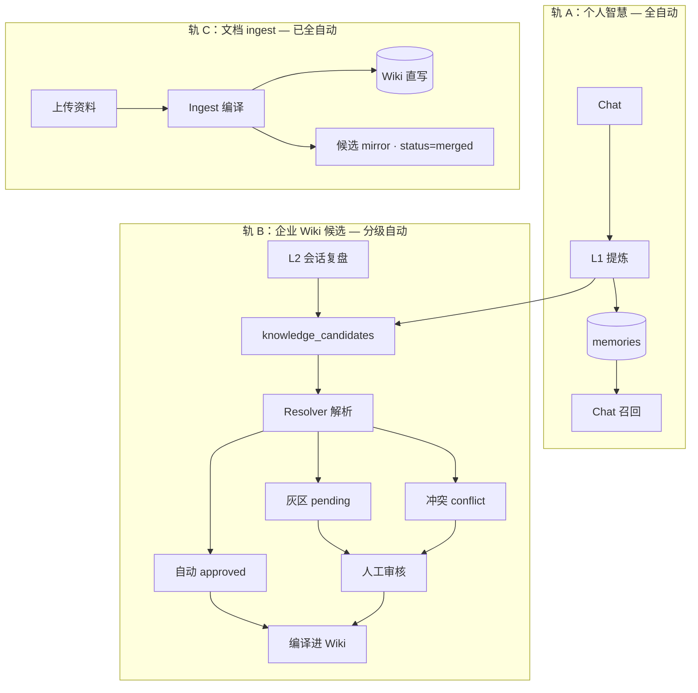

# 自动与人工审核分界线

> 知识候选池（`knowledge_candidates`）在量大时，人工审核适合作为**把关与异常处理**，不适合作为**全量入口**。  
> 本文基于当前代码与配置（`resolver.yaml`、`candidate_service.py`、`taxonomy.yaml`）整理，便于运营与产品决策。

---

## 一、三条轨，不是一条

系统里与「记忆 / Wiki」相关的数据流，实际有三条并行轨道：



| 轨道 | 是否人工 | 适合什么 |
|------|----------|----------|
| **A · memories** | 永不人工 | 偏好、项目上下文、个人决策记忆；服务 Chat 召回 |
| **B · candidates** | 分级 | 值得进入**企业 Wiki** 的候选事实 |
| **C · ingest** | 不人工（审计抽样即可） | 上传文档已是权威来源，直写 Wiki |

**人工审核页（`/human-review`）只管轨 B**，不管轨 A，也不管轨 C。

---

## 二、第一道门：进不进候选池

在 Resolver 与人工审核之前，条目是否进入 `knowledge_candidates` 由 `should_enqueue_for_wiki` 决定。

| 条件 | 结果 | 处理方式 |
|------|------|----------|
| 分类为 `preference` | **不进池**，只写入 `memories` | 全自动（轨 A） |
| L1/L2 动作为 `archive` | 不进池 | 全自动 |
| 分类 ∈ `wiki_categories`（decision / project / workflow / rule / product / methodology / entity） | **进池** | 进入轨 B |
| 其它分类且 `importance` < 0.85 | 不进池 | 全自动丢弃 |
| 其它分类且 `importance` ≥ 0.85 | 进池 | 进入轨 B |
| 同 org 已有同标题 `pending` 候选 | 去重跳过 | 全自动 |

配置来源：`settings/resolver.yaml` → `enqueue.importance_fallback: 0.85`；`settings/taxonomy.yaml` → `wiki_categories`。

### 分界线 ①

> **preference 永远不应出现在人工审核页。**  
> 例如「无糖啤酒、烤肉」→ 轨 A（memories + Chat 召回），不是 Wiki 候选池问题。

---

## 三、第二道门：Resolver 解析后的自动 / 人工

`POST .../candidates/resolve` 对 `pending` 候选执行规则匹配（见 `5-知识候选池.md`）。

| # | 条件 | 状态 | Resolver 动作 | 是否需要人工 |
|---|------|------|---------------|--------------|
| 1 | Wiki 标题模糊匹配 | `approved` | `supplement` + `target_wiki_path` | **否**（可自动 compile） |
| 2 | 同标题 `memory` 已存在且一致 | `approved` | `update` | **否** |
| 3 | 同标题但 `memory_id` 不一致 | `conflict` | — | **是，必审** |
| 4 | `confidence` ≥ **0.88** 且无匹配 | `approved` | `create` 新 Wiki 页 | **否**（可自动 compile） |
| 5 | 其它 | `pending` | `noop` | **是，必审** |

配置来源：`settings/resolver.yaml` → `auto_approve_confidence: 0.88`。

### 各来源的 confidence 如何赋值

| 来源 | confidence 赋值 | Resolver 后大概率 |
|------|-----------------|-------------------|
| **L1 chat** | = memory `importance`（模型打分） | ≥ 0.88 → 自动 `approved`；否则 `pending` |
| **L2 recap** | 固定 **0.75** | **几乎总是 `pending`**（除非命中 Wiki / memory 匹配） |
| **ingest** | 0.92，且直接 `status=merged` | **不进人工队列** |

配置来源：L2 使用 `recap_suggestion_confidence: 0.75`；ingest 使用 `ingest_mirror_confidence: 0.92`。

### 分界线 ②（当前代码下最真实的一条线）

```
confidence ≥ 0.88 且无 conflict  →  自动（解析后可 compile）
confidence < 0.88 或 status=conflict  →  人工
source = ingest  →  全自动（仅审计）
preference  →  不进此流程（轨 A）
```

### 重要发现：L2 复盘偏保守

L2 `wiki_suggestions` 固定 confidence = 0.75，低于 auto_approve 阈值 0.88，**设计上偏向人工**。  
若复盘量大，`pending` 会明显堆积——这是 L2 信任策略问题，不完全是审核页 UI 问题。

---

## 四、按分类的风险分级（建议运营策略）

在现有全局阈值之上，建议按**业务风险**再加一层策略（产品层，尚未全部写入代码）：

| 分类 | 风险 | 建议策略 |
|------|------|----------|
| **decision** | 高 | `confidence` ≥ 0.90 才自动；其余人工 |
| **rule** | 高 | 一律人工，或 ≥ 0.92 才自动 |
| **entity** | 中高 | 建议人工（EntityResolver 与 ingest 尚未深度整合） |
| **workflow** | 中 | ≥ 0.88 可自动（与现网一致） |
| **project** | 中 | ≥ 0.88 可自动 |
| **methodology** | 中低 | ≥ 0.85 可自动 |
| **product** | 中 | ≥ 0.88 可自动 |
| **other** | 低 | ≥ 0.85 可自动，或运营批量批准 |

### 分界线 ③（推荐的产品线）

```
高风险类（decision / rule / entity）
  → 人工必审，或阈值提高到 0.90 ~ 0.92

中风险类（project / workflow / product）
  → 沿用现网 0.88

低风险类（methodology / other）
  → 可降到 0.85，或 Resolver 后直接 compile
```

---

## 五、第三道门：编译进 Wiki

| 状态 | 当前行为 | 建议运营策略 |
|------|----------|--------------|
| `approved` | 需在 UI 点「编译进 Wiki」 | 高置信 + 非高风险类 → 未来可**自动 compile** |
| `pending` | 不可编译 | 须人工批准 |
| `conflict` | 不可编译 | 须人工裁决 |
| `merged` | 已完成 | 仅审计 / 抽检 |
| `rejected` | 已丢弃 | 无后续操作 |

### 分界线 ④

```
approved + 非 conflict + 非高风险类  →  可自动 compile（规模化阶段）
approved + 高风险类  →  人工确认后再 compile
pending / conflict  →  必须先人工
```

当前实现：`approved` 仍需人手触发 compile；候选量大时，这一步也会成为瓶颈。

---

## 六、合成决策表

候选条目从产生到落 Wiki 的完整路径：

| 来源 | 分类 | confidence | Resolver 结果 | 最终路径 |
|------|------|------------|---------------|----------|
| chat L1 | decision | 0.92 | `approved` | **全自动** → compile |
| chat L1 | decision | 0.82 | `pending` | **人工必审** |
| recap L2 | project | 0.75 | `pending` | **人工必审**（除非 Wiki 匹配） |
| recap L2 | workflow | 0.75 | `approved`（Wiki 匹配） | **全自动** |
| chat L1 | entity | 0.90 | `approved` | **建议人工**（质量风险） |
| any | any | any | `conflict` | **人工必审** |
| ingest | any | 0.92 | `merged` | **全自动**（审计即可） |
| — | preference | — | 不进池 | **轨 A · memories** |

---

## 七、量级与人力边界

在**当前阈值**下的粗算（假设 L1 `importance` 分布正常）：

| 日候选进池量 | Resolver 后约自动 `approved` | 约剩人工 | 人工耗时（按 1.5 分钟/条） |
|-------------|------------------------------|----------|---------------------------|
| 30 | ~18（60%） | ~12 | ~18 分钟 |
| 100 | ~55（55%） | ~45 | ~1.1 小时 |
| 300 | ~120（40%） | ~180 | ~4.5 小时（难持续） |
| 300 + L2 复盘占比高 | 自动比例更低 | 200+ | 不可持续 |

L2 复盘占比越高，人工比例越高（0.75 固定低于 0.88）。

### 分界线 ⑤（人力上限）

> **单人日审上限约 40～60 条**（含阅读、判断、批注）。  
> 超过此量，必须：提高自动阈值、缩小进池范围、或调整 L2 分流策略。

### 各日增量下「纯人工逐条审核」是否合适

| 日增量 | 评价 |
|--------|------|
| < 20 条 | 完全可行；小团队、冷启动 |
| 20～100 条 | 勉强；须依赖 Resolver 吃掉大部分 |
| 100～500 条 | 不宜逐条审；须分级自动 + 人只审冲突与灰区 |
| > 500 条 | 须规则引擎 + 抽样审计，而非 inbox 式全审 |

---

## 八、三档运营配置（可直接选用）

### 档 1 · 冷启动 / 小团队（< 30 条/天）— **当前阶段推荐**

| 环节 | 策略 |
|------|------|
| 进池 | 保持现状 |
| 自动批准 | `confidence` ≥ 0.88 |
| 人工 | 处理全部 `pending` + `conflict` |
| compile | 人工点击（建立对 Wiki 内容的信任） |

### 档 2 · 成长期（30～150 条/天）

| 环节 | 策略 |
|------|------|
| 进池 | decision / rule 提高 `importance` 门槛 |
| 自动 | 非高风险类 ≥ 0.88 → `approved` → **自动 compile** |
| 人工 | 仅 `conflict` + `pending` 中的 decision / rule / entity |
| 审计 | 每周抽样 5% 已 `merged` 条目 |

### 档 3 · 规模化（> 150 条/天）

| 环节 | 策略 |
|------|------|
| 进池 | 仅收 decision / project / methodology（workflow / rule 优先走 ingest） |
| L2 | `wiki_suggestions` 默认不进池，或提高置信度且强去重 |
| 自动 | methodology / project ≥ 0.85 全自动闭环 |
| 人工 | 审核页升级为「知识治理」：冲突台 + 周度质检 |
| 分工 | `memories` 承担个人上下文；Wiki 只存组织级事实 |

---

## 九、日常运营动作（轨 B）

推荐顺序（与 `/human-review` 页头按钮一致）：

1. **批量解析** — 让 Resolver 处理 `pending`，自动 `approved` 高置信条目  
2. **人工处理** — 仅看 `pending` + `conflict` 筛选  
3. **编译进 Wiki** — 将 `approved` 批量写入企业 Wiki  
4. **验收** — 在 Wiki 浏览或详情页检查 `merged` 结果  

人工审核页定位：**异常处理台 + 质检**，不是每一条的必经之路。

---

## 十、一句话分界线（团队共识）

```
┌─────────────────────────────────────────────────────────┐
│  个人记得住      →  memories（全自动，永不人工）          │
│  文档已权威      →  ingest（全自动，抽样审计）            │
│  企业 Wiki 事实  →  candidates 分级：                    │
│    · 无冲突 + 高置信 + 低风险类  → 自动到 Wiki           │
│    · 冲突 / 低置信 / 高风险类   → 人工审核页             │
└─────────────────────────────────────────────────────────┘
```

---

## 十一、待定的两个业务参数

确定档位前，建议明确：

1. **Wiki 权威度** — 写入错误是否有人被问责？  
   - 高 → decision / rule 倾向永远人工  
   - 低 → 可提高自动比例  

2. **L2 复盘占候选比例** — 每日复盘次数 × 每场 `wiki_suggestions` 条数  
   - 占比高 → 优先调整 L2 固定 0.75 策略或缩小进池  

**反推示例：**

| 场景 | 建议档位 |
|------|----------|
| 50 轮对话/天，~15 条进池，2 次 L2 复盘 | **档 1**，人工 ~20 分钟/天 |
| 200 轮对话/天，~80 条进池，10 次 L2 复盘 | **档 2**，须自动 compile + 缩小 L2 进池 |
| 500+ 轮/天，或多 org | **档 3**，审核页转为治理台 |

---

## 十二、相关文档与配置

| 资源 | 路径 |
|------|------|
| 候选池架构 | [5-知识候选池.md](./5-知识候选池.md) |
| 智慧进化 L1/L2 | [4-智慧进化.md](./4-智慧进化.md) |
| 解析阈值 | `knowledge_base/settings/resolver.yaml` |
| 分类词汇表 | `knowledge_base/settings/taxonomy.yaml` |
| Resolver 实现 | `knowledge_base/core/services/candidate_service.py` |
| 人工审核 UI | `webui` → `/human-review` |

---

## 修订记录

| 日期 | 说明 |
|------|------|
| 2026-06-08 | 初稿：基于现网 Resolver / 候选池 / 三轨架构整理自动与人工分界线 |
