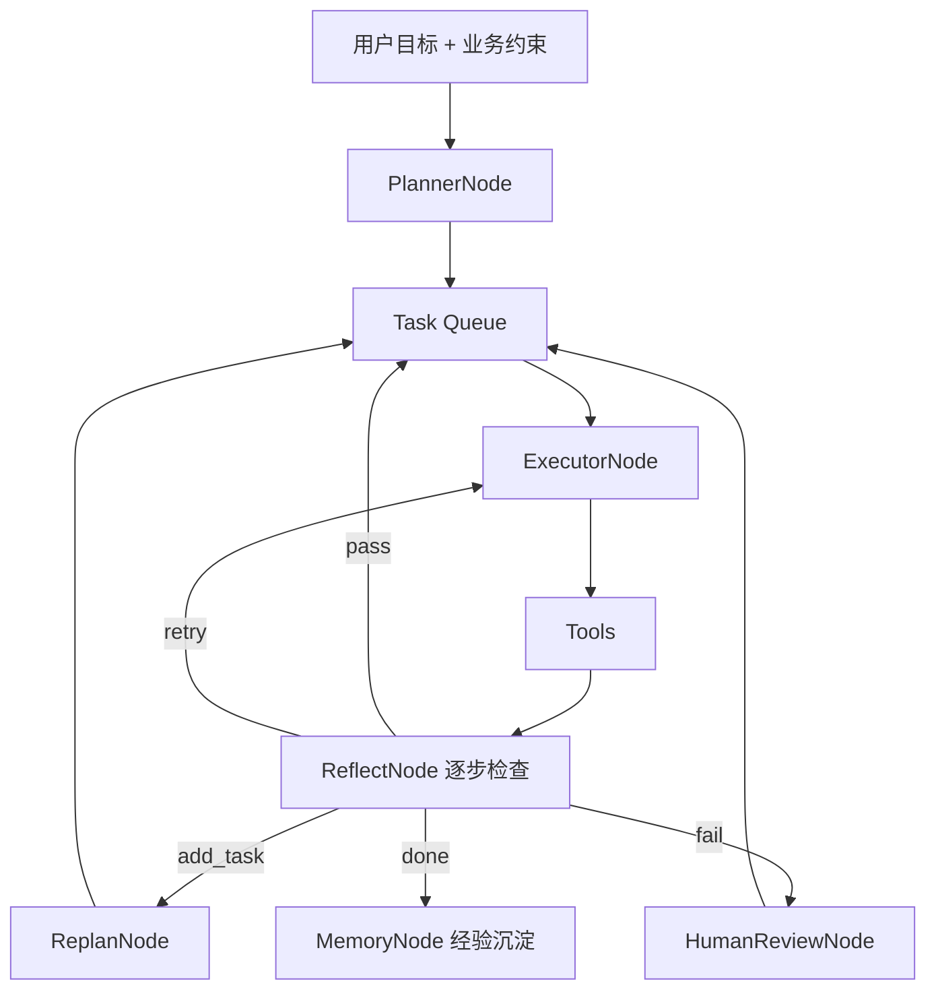

# 自主任务引擎

> HiveMindOS 核心能力：用户提出业务目标 → 系统自主规划、执行、反思、沉淀。  
> 完整设计见 [docs/plans/2026-06-09-plan-execute-reflect-design.md](../docs/plans/2026-06-09-plan-execute-reflect-design.md)

---

## 核心编排



---

## 节点说明

| 节点 | 职责 |
|------|------|
| **PlannerNode** | 拆解任务队列；匹配 Rubric；召回历史成功经验 |
| **PlanningCommittee** | 领域顾问 → 风险审查 → 主持人；角色见 [8-规划委员会配置.md](./8-规划委员会配置.md) |
| **Task Queue** | 子任务队列（pending → running → done / failed） |
| **ExecutorNode** | 按白名单调用 Tool，逐步执行 |
| **ReflectNode** | 按 Rubric 打分；决定 pass / retry / add_task / fail |
| **ReplanNode** | 信息不足时追加新任务 |
| **HumanReviewNode** | 低分、冲突、高风险写操作 → 人工批准后继续 |
| **MemoryNode** | 高分路径沉淀到 `agent_experience`，非全文存档 |

---

## 一句话

**Executor 做事，Reflect 判断能不能往下走，Memory 存路径不存废话。**

---

## StepReflect 决策

每步执行后按 Rubric 输出：

| status | 含义 |
|--------|------|
| `pass` | 进入下一任务 |
| `retry` | 重试本任务（≤2 次） |
| `add_task` | Replan 追加任务（≤3 次） |
| `fail` | 标记失败或转人工 |

## MVP 场景（C）

| 阶段 | 示例目标 | 工具域 |
|------|----------|--------|
| Phase 1 | 帮我整理本周项目决策进 Wiki | memory / wiki / candidate |
| **Phase 1.5** | 分析某某客户并生成销售方案 | + `web_search` / `read_url` |

### Phase 1.5 销售方案流水线（fallback）

```
search_wiki → web_search → read_url → list_entities
  → llm_generate(痛点) → llm_generate(销售方案)
```

- 网络搜索：优先 `TAVILY_API_KEY`，否则 DuckDuckGo（无需 Key）
- 经验召回：Qdrant `hivemind_experiences` 集合语义检索，回退 SQLite 高分记录

## API

```bash
# 创建并自动执行
curl -X POST http://localhost:8006/api/v1/orgs/demo/tasks \
  -H 'Content-Type: application/json' \
  -d '{"input":"帮我整理本周项目决策进 Wiki"}'

# 人工批准后继续
curl -X POST http://localhost:8006/api/v1/orgs/demo/tasks/{id}/approve

# 经验列表
curl http://localhost:8006/api/v1/orgs/demo/experiences
```

## 配置

| 文件 | 说明 |
|------|------|
| `settings/task_tools.yaml` | Planner 可见 action |
| `settings/task_gates.yaml` | 重试上限、compile 人工门 |
| `settings/rubrics/*.yaml` | 任务评分标准 |
| `TAVILY_API_KEY`（可选） | 高质量网络搜索 |
| `EXPERIENCE_COLLECTION` | 经验向量集合名，默认 `hivemind_experiences` |

## 相关文档

| 资源 | 路径 |
|------|------|
| 设计文档 v2 | [docs/plans/2026-06-09-plan-execute-reflect-design.md](../docs/plans/2026-06-09-plan-execute-reflect-design.md) |
| 实现计划 | [docs/plans/2026-06-09-plan-execute-reflect.md](../docs/plans/2026-06-09-plan-execute-reflect.md) |
| 自动与人工分界线 | [6-自动与人工审核分界线.md](./6-自动与人工审核分界线.md) |
| 自主任务页 | webui → `/tasks/agent`（任务中心） |
| 定时运维页 | webui → `/tasks/ops` |
| Chat 升级入口 | `/hivemind-chat` → 智能推荐或「从此对话创建任务」 |
| 规划委员会 | `planning_committee.yaml` 配置角色；`chat_upgrade` / `task_center` 触发 |
| 配置说明 | [8-规划委员会配置.md](./8-规划委员会配置.md) |

---

## 修订记录

| 日期 | 说明 |
|------|------|
| 2026-06-09 | 初稿：核心编排流程图 + 节点说明 |
| 2026-06-09 | 补充 StepReflect、MVP、API、配置 |
| 2026-06-09 | Phase 1.5：web_search、销售方案流水线、经验向量召回 |
